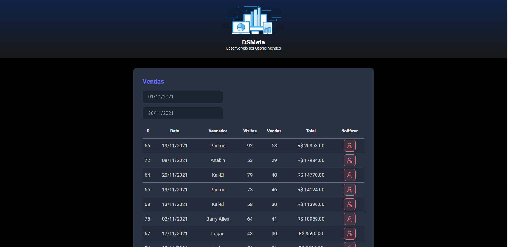
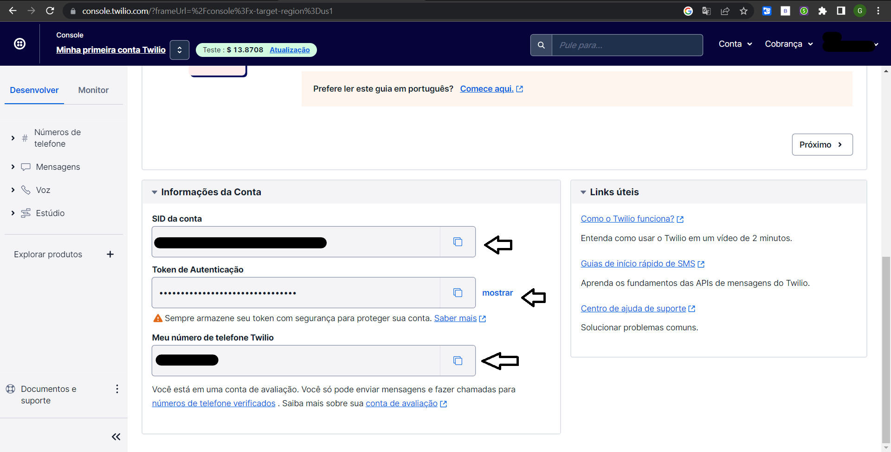
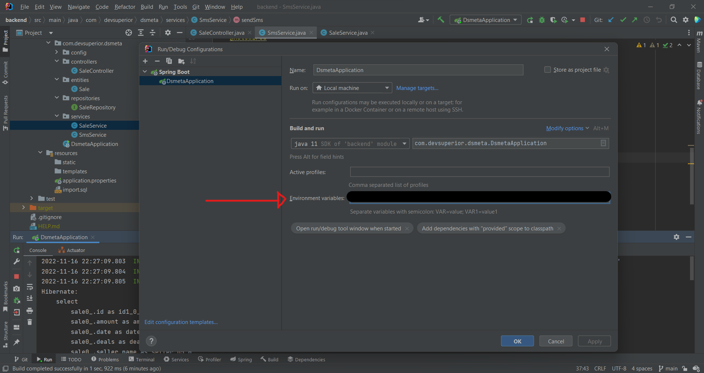

<h1 id="nome-do-projeto" align="center">DSMETA</h1>

- 📈 [Sobre o projeto](#about)
 - 📜 [Tarefas](#features)
- 🤖 [Tecnologias](#technologies)
- 🔧 [Aprendizados Back-end](#backend)
- 🎨 [Aprendizados Front-end](#frontend)
- 🎲 [Dependências](#dependency) 
- 💻 [Pré-requisitos](#requirements) 
- 🧑‍🔧 [Executando o projeto](#environment-install) 

🌎 **Acesse agora:** <a href="https://gabriel-dsmeta.netlify.app/" target="_blank" title="acessar o site"><strong>Link do site</strong></a>
<br />
### Visualização do site



<h2 id="about">📈 Sobre o projeto</h2> 

A aplicação consiste em fazer uma busca paginada e envio de sms dos dados da venda selecionada. Back-end construído com Java e Spring Boot e front-end com React/TypeScript/html e css

<h2 id="features">📜 Tarefas</h2>
Frontend

- [x] Montar o visual estático do front end
- [x] Integrar back end e front end
- [x] Implantar o front end

Backend
- [x] Criar entidades
- [x] Fazer mapeamento objeto-relacional (JPA)
- [x] Configurar dados de conexão do banco de dados H2
- [x] Fazer seed do banco de dados
- [X] Criar endpoints da API REST
- [X] Integração com SMS
- [X] Implantação na nuvem

<h2 id="technologies">🤖 Tecnologias</h2>  

- **Java 11**
- **Intellij [IDE de sua preferência]**
- **Hibernate JPA**
- **React**
- **Typescript**
- **H2 Database**
- **Axios**
- **Postman**
- **VSCode**
- **Heroku CLI**

<h2 id="backend">🔧 Aprendizados Back-end</h2> 

- Acesso a banco de dados
- Estruturar o back end no padrão camadas
  - Entities
  - Services
  - Controllers
  - Repositories
- Criar endpoints da API REST
- Integração com SMS
- Implantação na nuvem com CI/CD

<h2 id="frontend">🎨 Aprendizados Front-end</h2>  

- Integração do back end com front end
- Três pilares do React
  - Componentes
  - Props
  - Estado
- React Hooks
  - useState - Usado para alterar estado das variáveis além de definir um estado inicial. As variáveis ​​de estado são usadas para armazenar dados dinâmicos em nosso componente, que podem mudar conforme o usuário interage com ele.

  - useEffect - Usado para monitorar mudanças no ciclo de vida do componente. O useEffect aceita uma função e uma matriz de dependência como argumentos. A função será executada quando uma variável na matriz de dependência for alterada. Se nenhuma matriz de dependência for fornecida, a função será executada toda vez que o componente for renderizado novamente.
<br />

<h2 id="dependency"> 🎲 Dependências</h2>

```
Documentações:
twilio para envio de sms(backend):  https://www.twilio.com/pt-br/
twilio para envio de sms(backend): https://www.twilio.com/pt-br/docs/sms/quickstart/java
DatePicker: https://github.com/Hacker0x01/react-datepicker
axios: https://axios-http.com/ptbr/docs/intro
toastify: https://www.npmjs.com/package/react-toastify


# dependência para envio de sms.
<dependency>
	<groupId>com.twilio.sdk</groupId>
	<artifactId>twilio</artifactId>
	<version>8.31.1</version>
</dependency>

# DatePicker
yarn add react-datepicker@4.8.0 @types/react-datepicker@4.4.2

# biblioteca axios para realizar requisições
yarn add axios@0.27.2

# biblioteca para mensagens de confirmação, erros e etc.
yarn add react-toastify@9.0.5
```


<h2 id="requirements">💻 Pré-requisitos</h2>

Antes de começar, verifique se você atendeu aos seguintes requisitos:

* JDK 11 ou 17
* Intellij
* Postman
* Heroku CLI
* NodeJS (https://nodejs.org/en/download/)
* VS Code

<h2 id="environment-install">🧑‍🔧 Executando o projeto</h2> 

### Back end
__Clonando o repositório__
```shell
# clonar repositório
git clone https://github.com/Gabriel-developer-01/dsmeta-vendas.git

1. Abra a pasta backend em uma IDE java(Spring boot, Intellij e etc);
2. Instale as dependências do maven;
3. Configure as variáveis de ambiente como imagem abaixo(se for no intellij o formato ficaria assim): TWILIO_SID=[value];TWILIO_KEY=[value];TWILIO_PHONE_FROM=[value];TWILIO_PHONE_TO=[value]
4. Execute o projeto
```
Os valores das variáveis de ambietne pode-se no twilio



## Front end web
Pré-requisitos: node / yarn

```bash
# clonar repositório
git clone https://github.com/Gabriel-developer-01/dsmeta-vendas.git

# entrar na pasta do projeto front end web
cd frontend

# instalar dependências
yarn install

# executar o projeto
yarn dev
```

## 🤝 Perfil do dev

<table>
  <tr>
    <td align="center">
      <a href="https://www.linkedin.com/in/gabriel-mendes-3a668917b/">
        <br>
        <sub>
          <b>Gabriel Mendes</b>
        </sub>
      </a>
    </td>
  </tr>
</table>

[⬆ Voltar ao topo](#nome-do-projeto)
